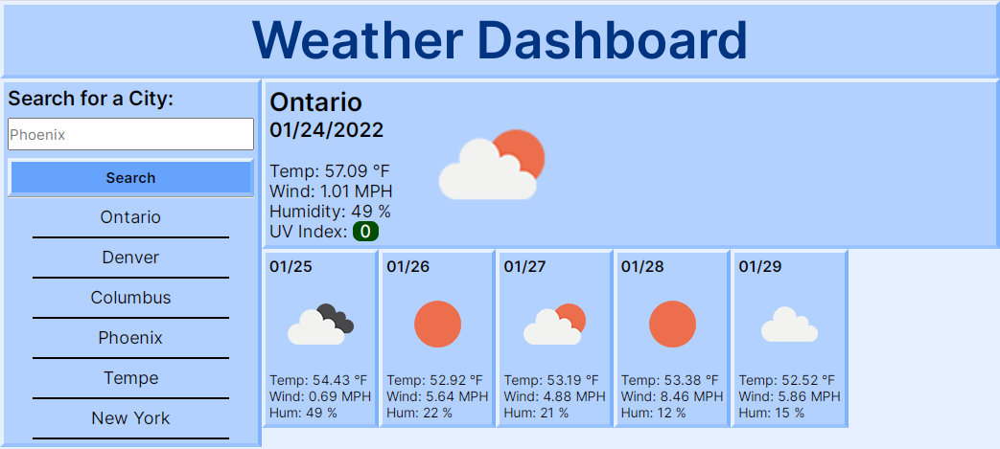

# Weather Dashboard

## Description

Use this to see the weather in different cities!
- Saves recent searches so you can check different cities easily
- Displays today's weather along with the 5-day forecast
- Helpful icons give you at-a-glance weather conditions!

## Website

You can access the deployed website here:
 
https://moses-ian.github.io/weather

### Screenshots

## Credits

- Followed functionality design from UofA Bootcamp
- [moment.js](https://momentjs.com/)
- [OpenWeather](https://openweathermap.org/)
- [Inter](https://fonts.google.com/specimen/Inter) font designed by Rasmus Andersson

## License

Please do not copy any of my code.

## Contributions

Made by Ian Moses